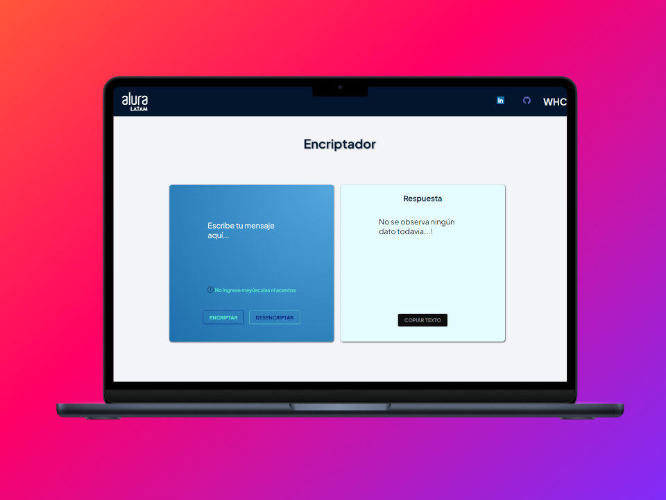

# Encriptador de Mensajes

Este es un sencillo encriptador de mensajes que te permite cifrar y descifrar mensajes de texto.

## Uso

1. Clona este repositorio o descarga el código.
2. Abre el archivo `encriptador.html` en tu navegador web.
3. Escribe el mensaje que deseas encriptar o descifrar en el cuadro de texto.
4. Haz clic en el botón "Encriptar" para cifrar el mensaje o en el botón "Descifrar" para revertir el proceso.
5. ¡Listo! Ahora puedes compartir tu mensaje encriptado de forma segura.

## Tecnologías Utilizadas

- HTML
- CSS
- JavaScript

## Contribuir

¡Siéntete libre de contribuir al desarrollo de este proyecto! Puedes abrir un problema para informar de errores o sugerir nuevas características. También puedes enviar una solicitud de extracción con tus mejoras.

## Autor

Este encriptador fue creado por [wilson huanca Callisaya](https://github.com/wallas83).

